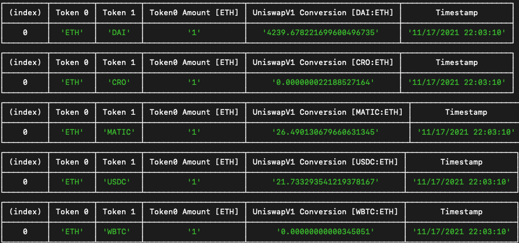

# Eth Bot Price Checker v0.1.0

Bot to check eth prices against other ERC-20 tokens.

Connects to the [Uniswap Factory smart contract](https://etherscan.io/address/0xc0a47dfe034b400b47bdad5fecda2621de6c4d95) on Ethereum mainnet via [web3.js](https://web3js.readthedocs.io/en/v1.7.0/).

## Quickstart

1. Clone project into empty directory:

   ```
   $ git clone https://github.com/yan-man/eth-bot.git
   ```

2. `cd` into directory
3. Get mainnet Infura RPC URL from: https://infura.io/
4. Copy `example.json` file to create `default.json` file in root `config` directory. Update `RPC_URL` field. `interval` field units are in seconds.

```js
{
  "RPC_URL": "https://mainnet.infura.io/v3/______________",
  "PORT": 3000
  "INTERVAL": 5
}
```

5. Install dependencies:

```
$ npm install
```

6. Run project:

```
$ npm run dev
```

7. In console, you should see price comparisons displayed in a table, updating in regular intervals defined by `INTERVAL` field in `default.json` config. NOTE: some prices seem off, probably due to Uniswap V1 implementation.



## Details

CRON jobs are set up to poll for data every 1 second. This can be configured in the `./index.js` file - `pollingInterval` variable.

The selection of tokens that are included are in `./services/tokens.js` file. Update relevant information to query for other token data.

## Further:

- Add more ERC-20 tokens to compare
- Add more DEXs to find price spread differences and identify arbitrage opportunities
- Update to UniswapV3 implementation
- Include slippage adjustment
- Perform swaps based on price spread differences
- Add unit tests
- maybe ethers.js instead; easier to work with

## Requirements

- `node v17.1.0`
- `npm v8.1.3`

## Author

Yan Man
